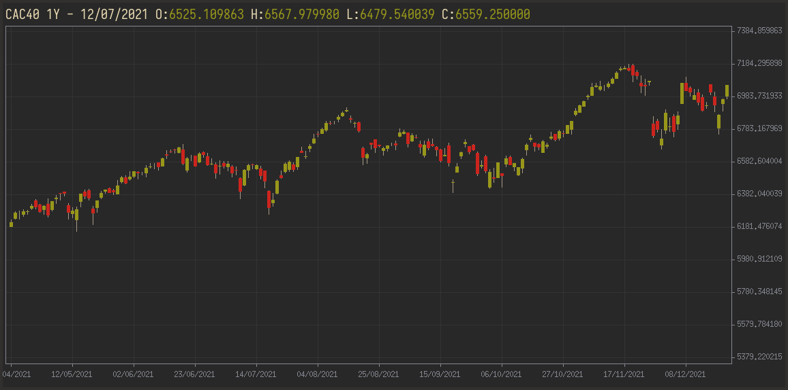

# candlestick

A candlestick chart widget to view historical financial data.  
This has been tested with data downloaded from [yahoo finance](https://finance.yahoo.com/) (see download link at [MSFT](https://finance.yahoo.com/quote/MSFT/history?p=MSFT)). This should work with any source provided the input is a CSV file with fields in the following order: <YYYY-MM-DD>,<Open>,<High>,<Low>,<Close>.



Chart title is set through the `-t` parameter.  
Scrolling is performed using left and right arrows.  

## quick start
```sh
% mk install
% cat data.csv |candlestick -t 'MSFT 1Y'
```

## license
MIT

